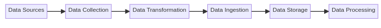
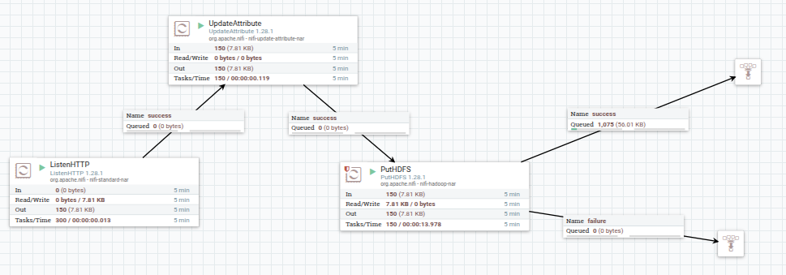

#  Data Ingestion Architecture using Apache NiFi and HDFS

##  Goal

Build a reliable pipeline to ingest real-time stock market data using **Apache NiFi** and store it in the **Hadoop Distributed File System (HDFS)**.

##  Components

 Data Producer :  `stock-producer.py` 
 Ingestion Tool : Apache NiFi    
 Storage System : Hadoop HDFS 

**Data Producer:** stock-producer.py is the source of the data , it simulates or sends stock data (like a stream). it acts like our “sensor” or data generator that  gernerates data in a real-time.

**Data Ingestion Tool:** we're using Apache NiFi as  our ETL tool (Extract → Transform → Load). It listens to data (via HTTP or TCP), optionally transforms it, and sends it to storage.wich is in our case is hadoop hdfs.

**Storage Layer:** we’re storing the data in HDFS (Hadoop Distributed File System), which is perfect for large-scale storage. it also uses the data-locality concept wich is a great thing for the next step wich is data processing ( using mapreduce - spark - hive... ) 

##  Data Flow :

Data Producer → NiFi (ETL) → HDFS (Storage)

## Apache NiFi Dataflow

This project uses an Apache NiFi flow for ingesting, processing, and storing stock data.

### Flow Summary:
- `ListenHTTP`: Receives real-time JSON data from a Python producer.
- `UpdateAttribute`: Adds a dynamic filename.
- `PutHDFS`: Stores the data in HDFS.

### Files:
- `nifi-template/stock-dataflow.xml`: NiFi template to import the flow.
- `nifi-template/flow-diagram.png`: Screenshot of the NiFi architecture.

1. **ListenHTTP Processor** : Listens for incoming HTTP requests on port 8090 to receive stock data

2. **UpdateAttribute Processor** : Adds/modifies attributes to the flow files (in this case, sets a dynamic filename to: stock_${now():format("yyyyMMddHHmmssSSS")}.json ) This creates a timestamped filename for each incoming data file

3. **PutHDFS Processor** : Writes the data to Hadoop Distributed File System (HDFS)
Hadoop Configuration Resources: /home/zangati/Downloads/hadoop-3.4.1/etc/hadoop/core-site.xml

4. **Connections** : The processors are connected in this sequence:

* ListenHTTP → UpdateAttribute (success relationship)

* UpdateAttribute → PutHDFS (success relationship)

PutHDFS has two outgoing connections:

* success → Funnel (id: 77836c21...)

* failure → Funnel (id: c557c509...)

5. **Funnels** : Two funnels are used to collect:

* Successful outputs (from PutHDFS success relationship)

* Failure outputs (from PutHDFS failure relationship)

The workflow is designed for real-time data ingestion of stock data 

A Python script (stock-producer.py) would be sending data to the ListenHTTP endpoint

The data is stored in HDFS with timestamped filenames

The entire flow is running continuously (scheduling strategy is TIMER_DRIVEN with 0 sec period)

This pipeline provides a simple but effective way to ingest real-time stock data into HDFS for further processing or analysis.

## Next Steps

After ingesting the data into HDFS, it can be processed using distributed computing tools such as Apache Spark, MapReduce, or Hive, depending on the analysis or transformation needs.

## How to Import the NiFi Template

### Steps to Use the Pipeline
1. Start Apache NiFi
Open NiFi in your browser:
http://localhost:8080/nifi

3. Import the NiFi Template
Select "Upload Template".
Upload the file: /nifi/nifi_real-time_data_ingestion_pipeline.xml
Right-click on the canvas → "Add Template" → select it → "Add".

3. Configure the Processors
Update the following processor settings:
* ListenHTTP:Set the port where the Python script will POST data (e.g., 8081).

* UpdateAttributes : create filename and give it a value : stock_${now():format("yyyyMMddHHmmssSSS")}.json ) wich creates a timestamped filename for each incoming data file

* PutHDFS:Set your HDFS output directory.

Ensure the NiFi instance has access permissions to the HDFS path.

4. Run the Python Producer
In a separate terminal, run:
python3 stock-producer.py

Make sure the script targets the same port as your NiFi ListenHTTP processor.

6. Start the Flow in NiFi
Start the entire process group in NiFi. You should see data flowing from the HTTP listener through the processors and finally into HDFS.

📂 Output
The ingested data will be stored in your configured HDFS directory.

Check your HDFS file system to verify the output after the flow runs.

